# Travel Blog - Explore the World 🌍

## 🔗 Live Project
- [Live Demo](https://cannavaro2010.github.io/Milestone02/index.html)
- [GitHub Repository](https://github.com/cannavaro2010/Milestone02)

---

## Description

Travel Blog is a responsive and interactive website where users can discover and buy travel packages, as well as get advice on affordable destinations around the world.  
The site features immersive travel stories, a blog with tips on cheap places to visit, and interactive tools to help users find the best deals.  
Key features include a photo gallery, embedded videos, Google Maps integration, and a spinning prize wheel for special offers and discounts.  
Built with HTML, CSS, Bootstrap, JavaScript, and jQuery, the site is designed for both inspiration and practical travel planning.

---

## Table of Contents

- [Features](#features)
- [Accessibility & UX](#accessibility--ux)
- [Screenshots & Wireframes](#screenshots--wireframes)
- [Testing](#testing)
- [Technologies Used](#technologies-used)
- [Installation & Usage](#installation--usage)
- [Deployment](#deployment)
- [Development Process & Version Control](#development-process--version-control)
- [Attribution & External Resources](#attribution--external-resources)
- [License](#license)
- [Statement of Originality](#statement-of-originality)
- [Contact](#contact)

---

## Features

- **Responsive Design:** Optimized for desktops, tablets, and smartphones.
- **Navigation Bar:** Clean, accessible, and collapsible navigation.
- **Embedded Video Section:** Showcases immersive travel content.
- **Interactive Photo Gallery:** Hover effects and scroll buttons for easy navigation.
- **Spinning Prize Wheel:** Users can spin to win discounts, vouchers, or free travel packages.
- **Google Maps Integration:** Displays location-based travel destinations.
- **Smooth Hover Effects:** For buttons, icons, and images using CSS transitions.
- **Contact Page:** Includes a contact form, prize wheel, and embedded map.

---

## Accessibility & UX

- All images have descriptive `alt` text.
- Semantic HTML structure with proper heading hierarchy.
- Keyboard-accessible navigation and controls.
- Sufficient color contrast and clear visual feedback on interactive elements.
- Responsive layout for all devices.
- Consistent styling and intuitive navigation.

---

## Screenshots & Wireframes

> **Note:** Screenshots and wireframes are included in the `img/screenshot-readme` folder.

- **Homepage:** 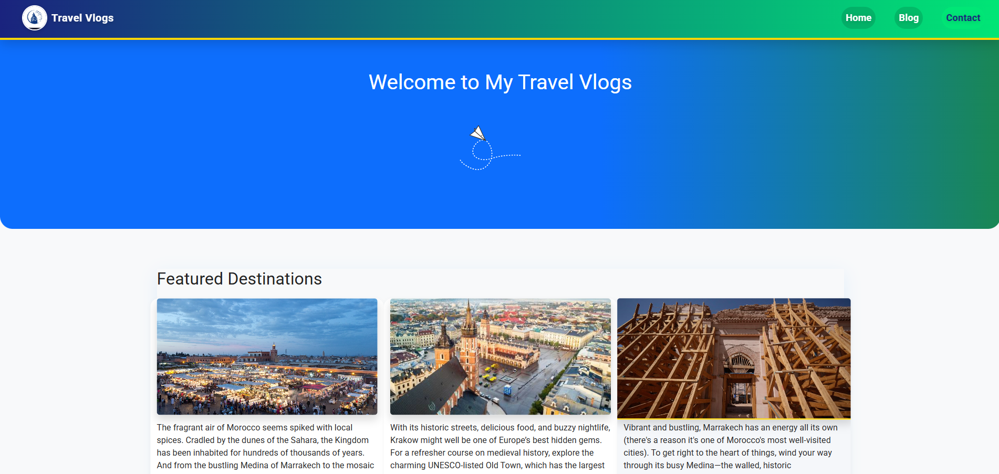.
- **Blog Page:** 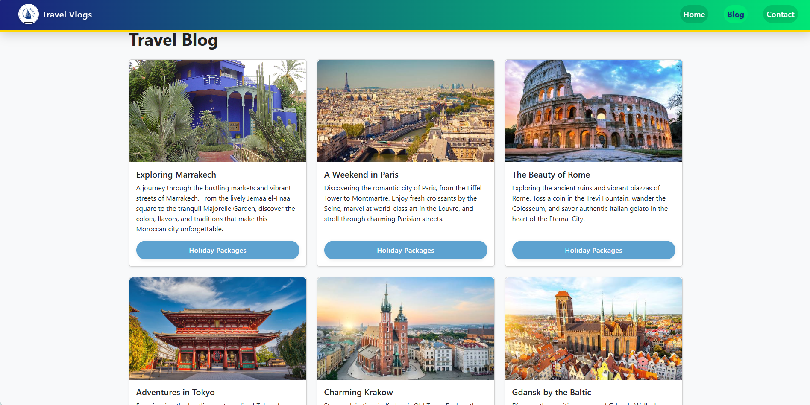
- **Contact Page:** 
- **Wireframes:** 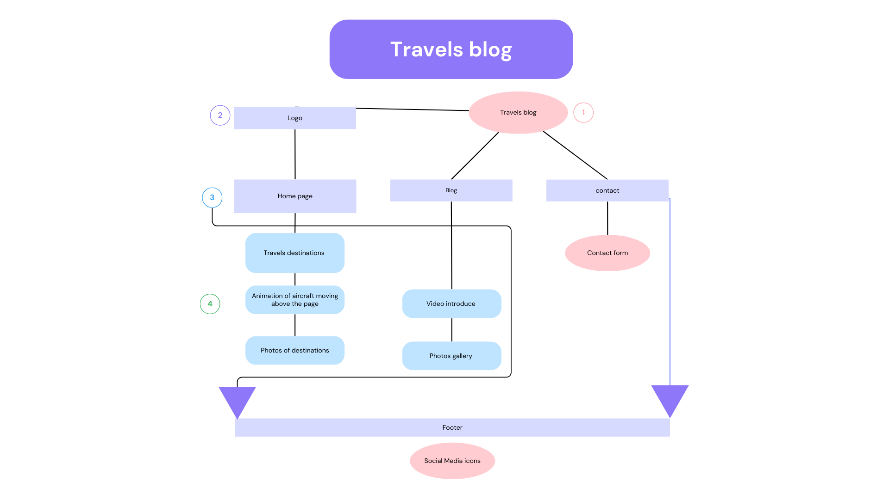

---

## Testing

### Automated Testing

- **W3C Validator:**
  
- > Note: The only CSS validation error reported by W3C is from the external Font Awesome CDN stylesheet, not from my own CSS code. All custom CSS passes validation..
  
- All HTML and CSS validated, no major errors.
- The test thoroughly evaluates all CSS measures.
- It ensures that CSS codes are unique and do not conflict with Bootstrap classes.
- The contract is checked to ensure it meets high standards for user experience.
- Colors are selected to be visually comfortable and non-straining for users' eyes


  
- **JSLint:**
- JavaScript passes linter with no major issues.
- Syntax Errors: Detects if there is a missing brackets, or incorrect variable declarations, and other syntax-related mistakes.
- Unused Variables: checking for flags variables that are declared but never used in the code.
- Global Variables: spot any identifies unintended global variables that may lead to conflicts.
- Coding Style: Ensures consistent indentation, spacing, and formatting based on best practices.
- Potential Bugs: Warns about issues like missing semicolons, accidental assignments in conditional statements, and unreachable code.
- ECMAScript Compatibility: find out about any highlights deprecated features or syntax that might not work across all JavaScript versions.

   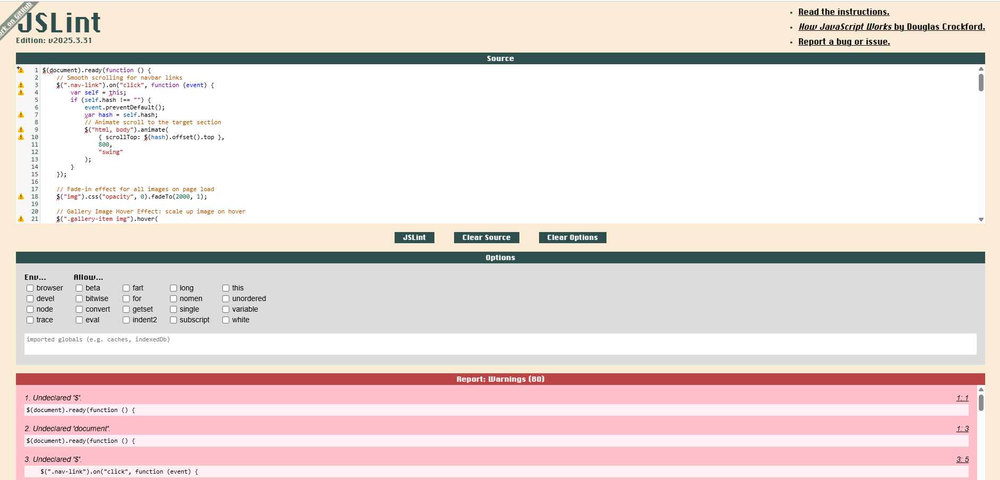  
  
- **Lighthouse:** Accessibility, performance, and best practices tested
- ## Known Issues with Lighthouse Audits

When running Lighthouse audits, you may encounter performance impacts due to browser extensions or stored data. Here are two common issues:

### 1. Extensions Affecting Performance
Chrome extensions can negatively impact page load performance, leading to lower Lighthouse scores. To mitigate this:
- Run the audit in **Incognito Mode**.
- Use a **Chrome profile without extensions**.

### 2. IndexedDB Stored Data Impact
Stored data in IndexedDB may also influence performance metrics. To prevent this:
- Conduct the audit in an **Incognito Window** to avoid interference from previously stored resources.

Following these steps can help ensure more accurate Lighthouse results.

- 
  ## Lighthouse Testing


- **Performance Improvements**:
- I removed unnecessary CSS code to streamline styles and enhance efficiency.
- I avoided inline CSS to improve rendering and maintain a structured approach.
- I resized images to reasonable dimensions for faster load times and better responsiveness.
  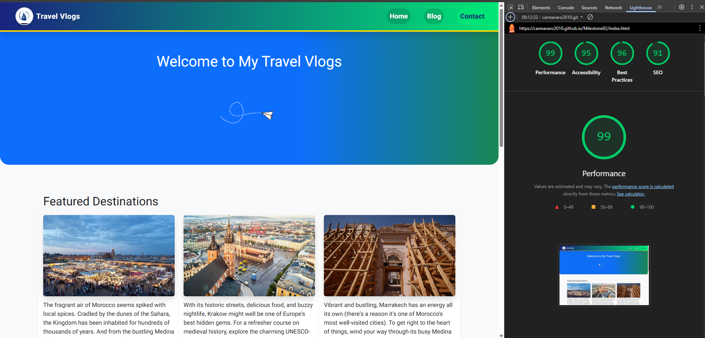

- **Accessibility Enhancements**:
- I implemented ARIA label attributes to improve navigation for screen readers.
- I added alt descriptions for all images, ensuring better accessibility for visually impaired users.
  
  
  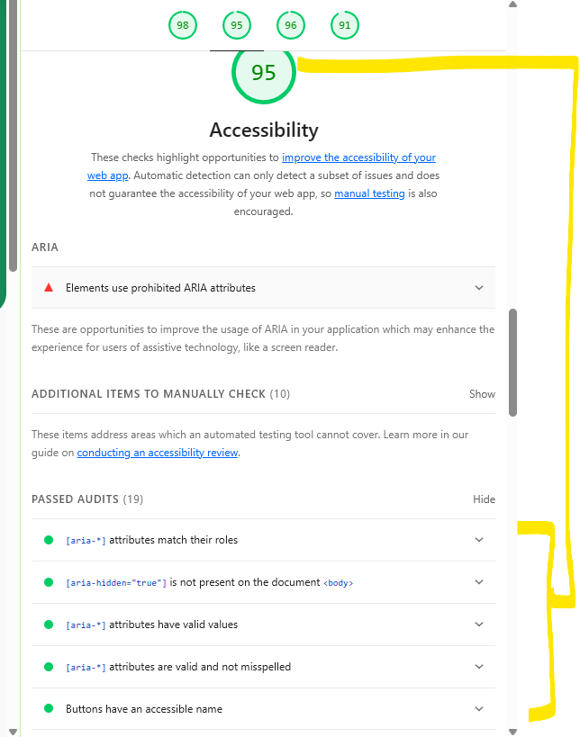

- **Best Practices**: Reviews security, coding standards, and modern development techniques.
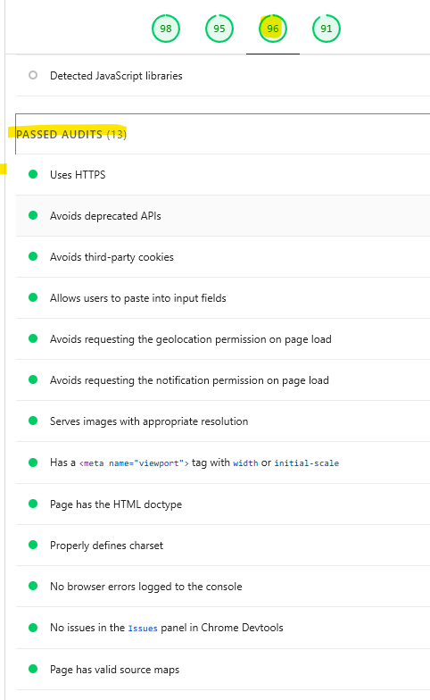
  
- **SEO**: Identifies improvements to help the site rank better in search engines(google).
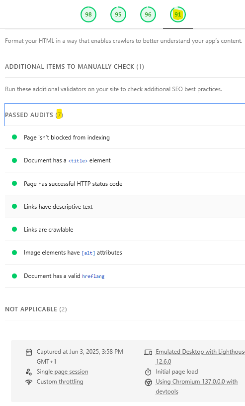
  
- **Progressive Web App (PWA)**: Evaluates offline capabilities and fast-loading features.

Lighthouse generates a detailed report with scores and actionable recommendations, helping developers optimize their websites for a better user experience. It can be run through Chrome DevTools, a command-line interface, or as a Node.js module.


For best results, run audits in **Incognito Mode** or a profile without extensions to prevent interference with page performance.


  ### Running Lighthouse Audits
To perform an audit:
1. Open Chrome DevTools (`F12` or `Ctrl + Shift + I`).
2. Navigate to the **Lighthouse** tab.
3. Select the audit categories and click **Run Audit**.
 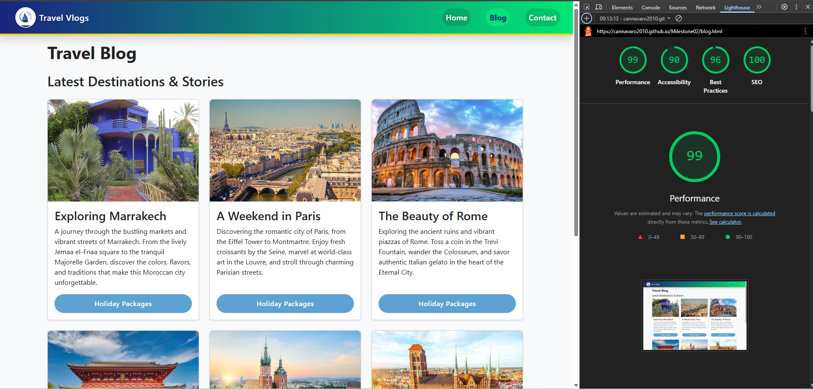.
- **Jest:**  

Unit tests were written using **Jest** to ensure the reliability of key interactive features and JavaScript functions.  
The following areas were covered:

- **Smooth Scrolling:**  
  Tests verify that clicking navigation links scrolls to the correct section and handles invalid hashes gracefully.

- **Gallery Slider:**  
  Tests confirm correct image navigation (next/prev), index wrapping, and that only the intended image is displayed at a time.

- **Hover Effects:**  
  Tests ensure that gallery images scale up on hover and return to normal on mouse out.

- **Auto-Slide Functionality:**  
  Tests check that the gallery auto-advances images at the correct interval and updates the index as expected.

- **Prize Spinner:**  
  Tests validate that the prize wheel selects a valid prize, prevents multiple spins at once, and handles spin logic correctly.

All tests passed, confirming that the main interactive features work as intended and edge cases are handled.  
Test files and results can be found in the `/script/functions.test.js` file.. 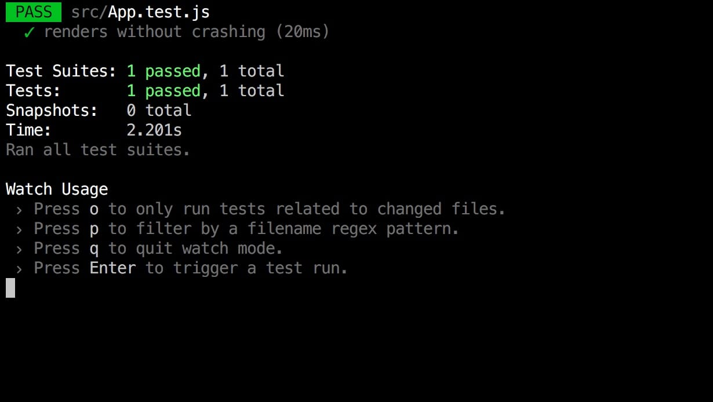.

## Manual Testing

Manual testing was performed on all main pages (Home, Blog, Contact) to ensure functionality, accessibility, and design consistency. Below are the test cases, steps, and results:

---

### Home Page

- **Navigation:**  
  - All navbar links work and highlight the current page.
  - When switching to mobile mode, the navigation bar seamlessly transforms into a toggle button positioned in the top corner of the page.
    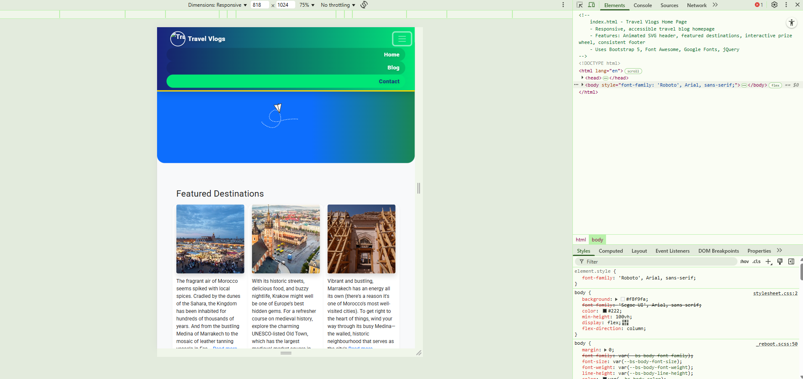.

- ### Blog Page:**  
  - All images load and display correctly.
  - The gallery slider arrows are well-sized, ensuring an intuitive and user-friendly navigation experience. Their design enhances usability, making it easy for users to browse through images smoothly and efficiently
  - .
    


- **Links:**  
  - All "Holiday Packages" links open in a new tab without any issues.
 


### Contact Page

- **Contact Form:**  
  - All fields have labels and required validation.
    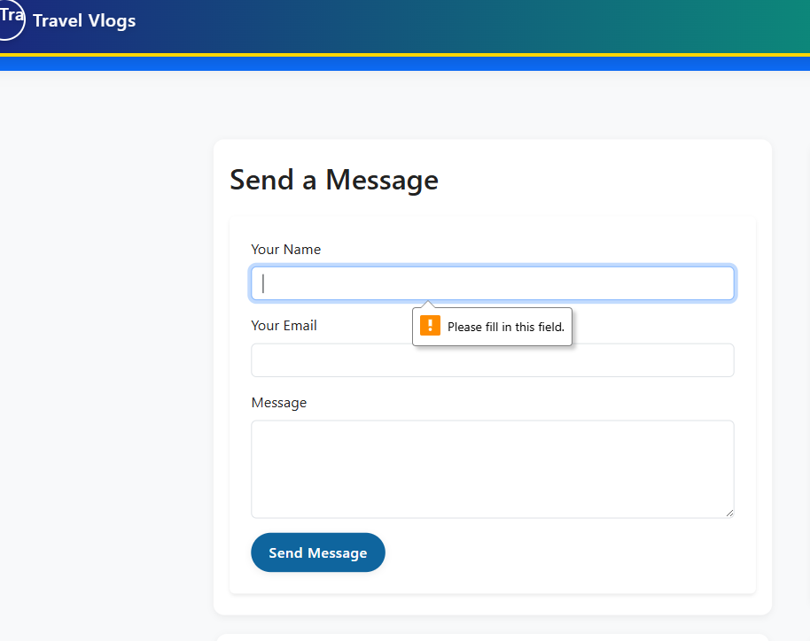.
    
  - The submit button is properly labeled and accessible, upon submission, a message appears at the bottom confirming a response within 5 days.
    
    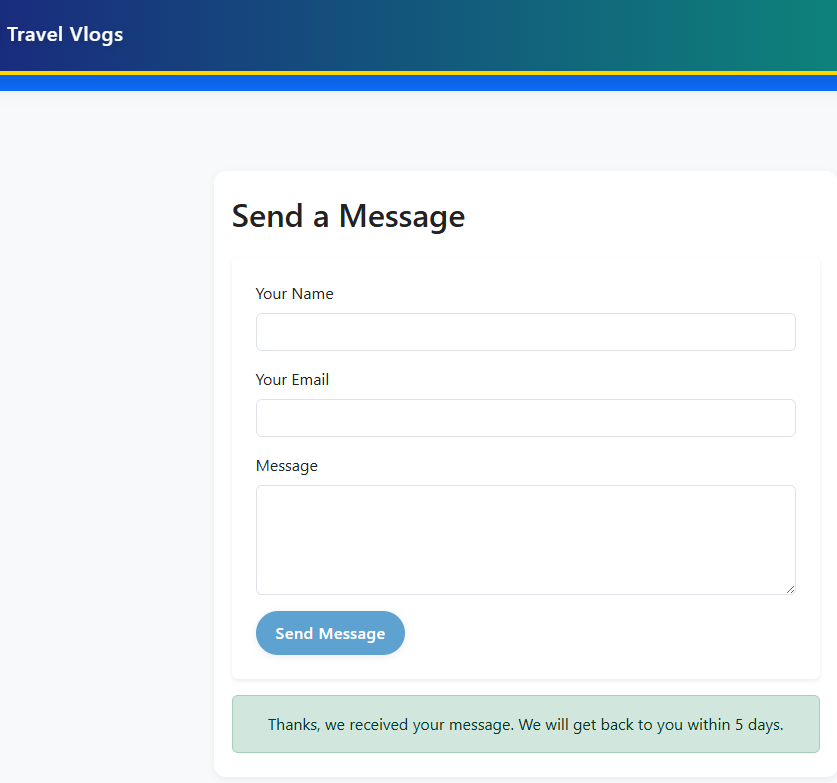.

- **Gallery Slider:**  
  - The Prev/Next buttons function correctly.
  - Each image includes a descriptive alt attribute explaining its content
    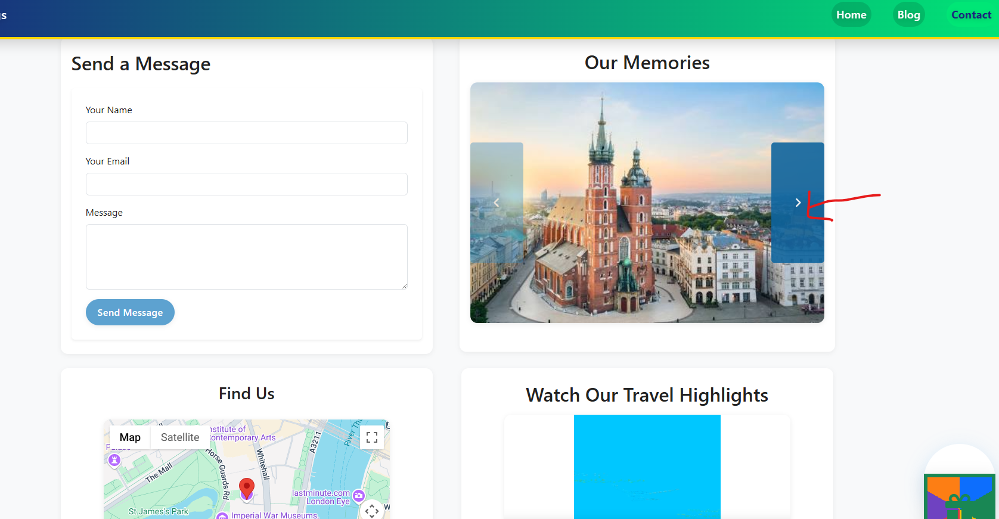.

- **Map & Video:**  
  - Google Map loads and is visible proprely.
  - Video player works and is accessible.
    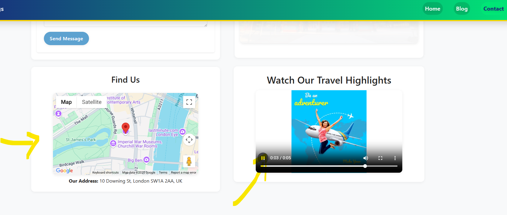.

- **Floating Prize Wheel:**  
  - A successful input confirmation appears upon clicking the prize button.
     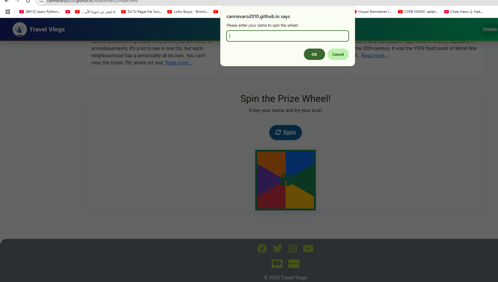.
    
  - After an input name is taken, the prize spins correctly
   
    .
    
    The outcome correctly displays the name you provided.
    
    .

- **Footer:**  
  - When I come across the footer code, all ARIA labels, links, and icons are well-organized..

    .png).

---

### Summary& Testing table

All pages of my milestone were manually tested in Chrome and Edge on desktop and mobile.  
Accessibility and contrast issues flagged by Lighthouse were fixed recently.  
No broken links or missing images were found.  
All interactive elements are accessible .
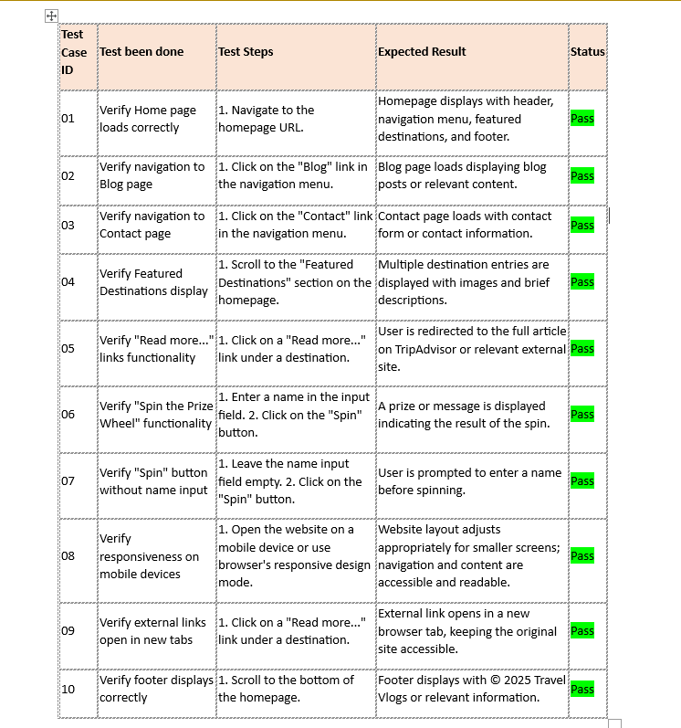.

> **Screenshots of each test and commentary are included in the `/img/tests_imgs/` folder.**

---

## Technologies Used

- HTML5
- CSS3
- Bootstrap 5
- JavaScript (ES6)
- jQuery 3.7.1
- Google Maps JavaScript API
- Copilot AI (just for grammar and phrasing purposes).

---

## Installation & Usage

1. **Clone the repository:**
    ```sh
    git clone https://github.com/cannavaro2010/Milestone02.git
    ```
2. **Open `index.html` in your browser** or deploy to GitHub Pages.

---

## Deployment

- Deployed via **GitHub Pages**: [Live Demo]([YOUR_GITHUB_PAGES_LINK_HERE](https://cannavaro2010.github.io/Milestone02/index.html))
- All code and assets organized in subfolders (`img/`, `css/`, `script/`, `video/`, `screenshots/`).
- No commented-out code or broken internal links.

---

## Development Process & Version Control

- Project tracked with **Git** and **GitHub**.
- Frequent, descriptive commits for each feature/fix.
- All code organized by file type and named consistently (lowercase, no spaces).
- README documents the full development cycle, rationale, and user stories.
- UX design work (wireframes, mockups) included in `/screenshots/` with commentary.
- Testing procedures and results documented with screenshots and explanations.

---

## Attribution & External Resources

- **Photos:** TripAdvisor UK, Google Images, Wikipedia (city descriptions)
- **Video:** Downloaded from Youtube
- **Libraries:** Bootstrap, Font Awesome, jQuery
- **Code:** All custom code is original. Any snippets or tutorials are attributed in code comments and here.
- **Google Maps:** [Google Maps JavaScript API](https://developers.google.com/maps/documentation/javascript/overview)

---

## License

This project is licensed under the MIT License. See the [LICENSE](LICENSE) file for details.

---

## Statement of Originality

I, Youssef Abassir, confirm that this project is my own work.  
All external resources are credited above.

---

## Contact

Youssef Abassir  
[abassir@hotmail.fr]  
[https://github.com/cannavaro2010]
